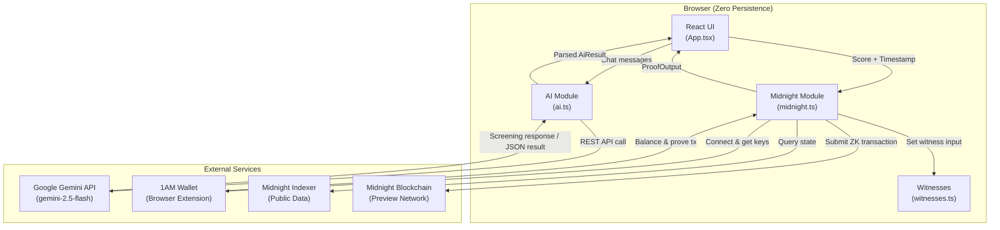
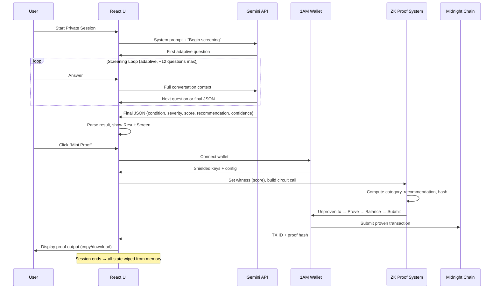
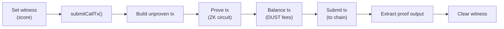
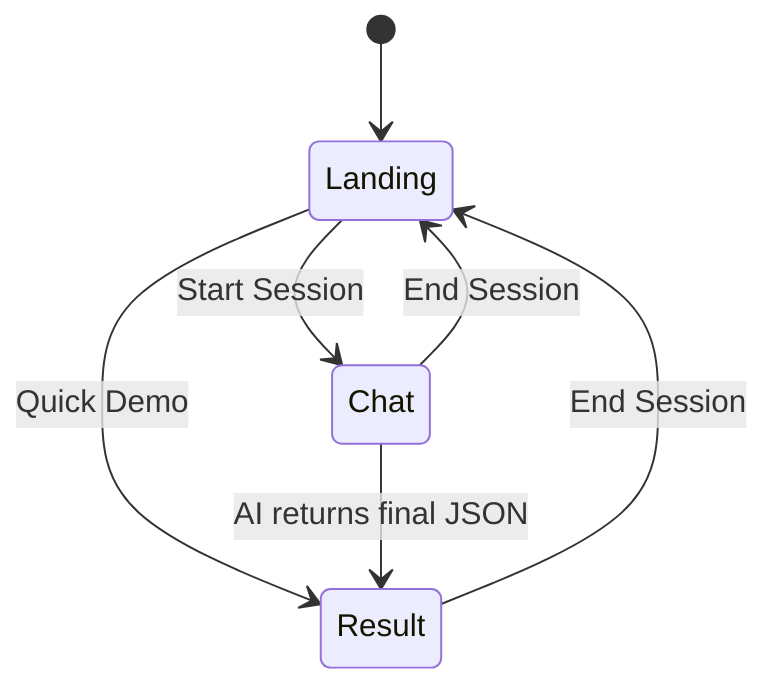

# MindSafe — Complete Codebase Analysis

> **Private AI mental health screening, verified by zero-knowledge proof on the Midnight blockchain.**

---

## 1. Executive Summary

**MindSafe** is a browser-based decentralized application (dApp) that conducts AI-powered clinical mental health screenings with **absolute privacy guarantees**. The user's conversation never leaves the browser session — no server, no database, no localStorage. Only a cryptographic commitment hash and a de-identified proof output are minted on-chain via the **Midnight Network's** zero-knowledge (ZK) proof system.

| Dimension | Detail |
|-----------|--------|
| **Type** | Privacy-first health-tech dApp |
| **Blockchain** | Midnight Network (ZK-based, data-protection chain) |
| **AI Engine** | Google Gemini API (gemini-2.5-flash) |
| **Frontend** | React 19 + TypeScript 6 + Vite 8 |
| **Smart Contract** | Compact language (Midnight's domain-specific ZK contract language) |
| **Wallet** | 1AM browser extension wallet |
| **Storage** | Zero persistence — React `useState` only |

---

## 2. Business Perspective

### 2.1 Problem Statement

Mental health screening carries an extreme stigma barrier. People avoid seeking help because:
1. **Fear of a permanent record** — medical records, insurance implications, employer access.
2. **Identity exposure** — traditional telehealth platforms require accounts, emails, phone numbers.
3. **Trust deficit** — users cannot verify that their data isn't logged server-side.

### 2.2 Value Proposition

MindSafe eliminates all three barriers by combining:

| Barrier | MindSafe Solution |
|---------|-------------------|
| Permanent record | Conversation exists only in browser memory; wiped on session end |
| Identity exposure | No account, no login, no PII — wallet connection is optional and pseudonymous |
| Trust deficit | ZK proofs provide **cryptographic proof** that only the screening outcome (category + recommendation) was recorded — not the conversation |

### 2.3 Target Market

- **Primary**: Individuals who suspect they may have a mental health condition but are reluctant to seek formal screening due to privacy concerns.
- **Secondary**: Healthcare organizations, insurers, or employers who want to offer anonymous screening as a benefit without collecting identifiable health data.
- **Tertiary**: Web3/privacy-focused users already in the Midnight ecosystem looking for real-world utility applications.

### 2.4 Revenue / Monetization Opportunities

The current codebase is a proof-of-concept with no monetization layer, but natural business models include:
- **B2B licensing** to healthcare providers who embed MindSafe as a widget.
- **Premium screening packs** (specialized instruments like PHQ-9, GAD-7, PCL-5 run in full fidelity).
- **On-chain credential marketplace** where ZK-proven screening results can be selectively disclosed to therapists, insurers, or employers.

### 2.5 Competitive Differentiation

| Feature | MindSafe | Typical Telehealth | Web3 Health Apps |
|---------|----------|--------------------|--------------------|
| No account required | ✅ | ❌ | ❌ (wallet required) |
| Zero data persistence | ✅ | ❌ | ❌ |
| AI-adaptive screening | ✅ | ❌ (static forms) | ❌ |
| On-chain verifiable proof | ✅ | ❌ | Partial |
| ZK privacy guarantee | ✅ | ❌ | ❌ |
| No backend / server | ✅ | ❌ | ❌ |

---

## 3. Architecture Overview



### 3.1 Data Flow (End-to-End)



---

## 4. Technical Deep Dive

### 4.1 Project Structure

```
mindsafe/
├── contracts/
│   ├── mindsafe.compact          # Smart contract source (Compact language)
│   ├── witnesses.ts              # Private witness inputs for ZK circuit
│   ├── index.ts                  # Re-exports contract + witnesses
│   └── managed/mindsafe/         # Compiled output (git-ignored)
│       ├── contract/             # Runtime contract JS
│       ├── keys/                 # ZK proving keys
│       ├── zkir/                 # ZK intermediate representation
│       └── compiler/             # Compiler metadata
├── scripts/
│   └── sync-zk.mjs              # Copies ZK assets → public/zk/
├── src/
│   ├── App.tsx                   # Main UI component (465 LOC)
│   ├── App.css                   # Component styles (393 LOC)
│   ├── index.css                 # Design system / CSS variables
│   ├── main.tsx                  # React entry point
│   ├── lib/
│   │   ├── ai.ts                 # Gemini API integration (103 LOC)
│   │   └── midnight.ts           # Blockchain/wallet integration (325 LOC)
│   └── assets/                   # Static images
├── public/
│   ├── favicon.svg
│   ├── icons.svg
│   └── zk/mindsafe/              # ZK assets served to browser (git-ignored)
├── index.html                    # HTML shell
├── vite.config.ts                # Vite + WASM + top-level-await plugins
├── package.json                  # Dependencies & scripts
├── .env / .env.example           # Environment configuration
├── tsconfig.json                 # TypeScript project references
├── COMPILE_AND_DEPLOY.md         # Contract compilation guide
└── README.md                     # Project documentation
```

**Total application code**: ~1,286 lines across 7 source files (excluding compiled artifacts, config, and styles).

---

### 4.2 Smart Contract — `mindsafe.compact`

The Compact contract is the cryptographic core of the application. It implements the ZK circuit that proves a screening outcome without revealing the raw score.

```
pragma language_version >= 0.16;
import CompactStandardLibrary;
```

#### Ledger State

```
export ledger proofs: Set<Bytes<32>>;
```

- A **public set of 32-byte proof hashes** stored on-chain.
- Each hash is a `persistentHash` of the user's severity score.
- The set grows with each screening — no personal data, only cryptographic commitments.

#### Enums

| Enum | Variants | Purpose |
|------|----------|---------|
| `ResultCategory` | `MILD`, `MODERATE`, `SEVERE` | Classification bucket |
| `Recommendation` | `SELF_CARE`, `TALK_TO_PRO`, `URGENT` | Action guidance |

#### Circuits

| Circuit | Type | Input | Output | Purpose |
|---------|------|-------|--------|---------|
| `computeCategory` | `pure` | `score: Uint<0..100>` | `ResultCategory` | Maps score → severity tier |
| `computeRecommendation` | `pure` | `category` | `Recommendation` | Maps category → action |
| `submitScreening` | `export` (callable) | `timestamp: Uint<64>` | `[ResultCategory, Recommendation, Uint<64>, Bytes<32>]` | Main transaction circuit |

#### Privacy Model

```
const score = severityScore();              // ← Private witness (never disclosed)
const proofHash = persistentHash(score);    // ← Hash commitment
proofs.insert(disclose(proofHash));         // ← Only hash goes on-chain
return [
    disclose(category),                     // ← Public output
    disclose(recommendation),               // ← Public output
    disclose(timestamp),                    // ← Public output
    disclose(proofHash),                    // ← Public output
];
```

> [!IMPORTANT]
> The raw `score` value **never leaves the ZK circuit**. The `severityScore()` witness is a private input. Only the derived category, recommendation, timestamp, and hash are `disclose()`-d as public outputs.

#### Score Thresholds

| Score Range | Category | Recommendation |
|-------------|----------|----------------|
| 0–6 | MILD | SELF_CARE |
| 7–13 | MODERATE | TALK_TO_PRO |
| 14–100 | SEVERE | URGENT |

---

### 4.3 Witness System — `witnesses.ts`

The witness module acts as a **private input bridge** between the TypeScript runtime and the ZK circuit:

```typescript
let pendingInput: ScreeningInput | null = null

export function setScreeningInput(input: ScreeningInput) {
  pendingInput = input
}

export const witnesses = {
  severityScore() {
    return pendingInput?.severityScore ?? 0n
  },
}
```

- **Singleton pattern**: Only one screening can be in-flight at a time.
- **Cleared after use** via `clearScreeningInput()` in a `finally` block.
- The witness function is called by the ZK proving engine during circuit execution.

---

### 4.4 AI Engine — `ai.ts`

#### Integration

- **Provider**: Google Gemini API (REST, not SDK)
- **Model**: `gemini-2.5-flash` (configurable via `VITE_GEMINI_MODEL`)
- **Temperature**: `0.2` (low randomness for clinical consistency)
- **Authentication**: API key passed as URL parameter

#### System Prompt Design

The system prompt uses XML-style structured sections:

| Section | Purpose |
|---------|---------|
| `<role>` | Identity as "MindSafe Clinician" |
| `<purpose>` | Adaptive, privacy-first screening |
| `<guidelines>` | Brevity, no hard question cap, skip-ahead support |
| `<output_format>` | Strict JSON schema for final output |
| `<example>` | Concrete JSON example to ground the model |

#### Response Parsing — `tryParseFinal()`

A robust JSON extraction pipeline:
1. Attempt direct parse if response starts/ends with `{}`
2. Fall back to extracting the first `{...}` substring
3. Validate all required fields and types
4. Validate `severity` against allowed enum values

> [!NOTE]
> This defensive parsing is critical because the AI model sometimes wraps JSON in markdown code blocks or adds explanatory text around the JSON output.

---

### 4.5 Midnight Integration — `midnight.ts`

This is the most complex module (325 LOC) and handles the full blockchain transaction lifecycle.

#### Wallet Detection

```typescript
async function detectWallet(): Promise<any | null> {
  // Polls window.midnight['1am'] or window.midnight.mnLace
  // up to 60 times (6 seconds) with 100ms intervals
}
```

- Supports both **1AM** and **mnLace** wallet extensions.
- Includes a **Dev Mock** mode that injects a fake wallet for local testing.

#### Provider Assembly

The `mintProof()` function assembles 6 provider objects:

| Provider | Source | Purpose |
|----------|--------|---------|
| `privateStateProvider` | Custom in-memory | Manages contract private state |
| `publicDataProvider` | `@midnight-ntwrk/midnight-js-indexer-public-data-provider` | Reads on-chain public state |
| `zkConfigProvider` | `@midnight-ntwrk/midnight-js-fetch-zk-config-provider` | Fetches ZK proving keys from `/zk/mindsafe/` |
| `proofProvider` | Custom wrapper | Delegates proving to wallet |
| `walletProvider` | Custom → 1AM API | Provides coin keys + transaction balancing |
| `midnightProvider` | Custom → 1AM API | Submits final transaction to chain |

#### Transaction Flow



#### Private State Provider

A custom in-memory implementation scoped by contract address:

```typescript
{
  setContractAddress(address) { scope = address },
  async set(id, state) { stateStore.set(key(id), state) },
  async get(id) { return stateStore.get(key(id)) ?? null },
  // ... signing keys, clear, remove
}
```

> [!TIP]
> This is a fully browser-based state provider — no IndexedDB, no localStorage. State lives and dies with the browser tab, reinforcing the zero-persistence guarantee.

#### Hex Utilities

Custom `toHex()` and `fromHex()` functions handle serialization between `Uint8Array` and hex strings for transaction wire format.

---

### 4.6 Frontend — `App.tsx`

#### Screen State Machine



#### Three Screens

| Screen | Purpose | Key Components |
|--------|---------|----------------|
| **Landing** | Hero section, value proposition, CTAs | Brand, hero card showing what goes on-chain, disclaimer |
| **Chat** | Adaptive AI conversation | Chat panel (messages + input), side panel (privacy guardrails, session flow, debug) |
| **Result** | Screening summary + proof minting | Result card (condition, severity, score, confidence), proof JSON viewer, copy/download |

#### State Management

All state is `useState` — no external state library, no persistence:

| State | Type | Purpose |
|-------|------|---------|
| `screen` | `'landing' \| 'chat' \| 'result'` | Current view |
| `messages` | `ChatMessage[]` | Full conversation history |
| `input` | `string` | Current user input |
| `isThinking` | `boolean` | Loading state |
| `result` | `AiResult \| null` | AI screening output |
| `proof` | `ProofOutput \| null` | Minted ZK proof |
| `walletAddr` | `string \| null` | Connected wallet address |
| `error` | `string \| null` | Error messages |
| `connectionLog` | `string[]` | Debug log for wallet connection |
| `devMockEnabled` | `boolean` | Dev mock wallet toggle |

#### Dev Tools

- **Dev Mock Wallet**: Injects a mock `window.midnight['1am']` object for testing without a real wallet.
- **Connection Debug Panel**: Expandable `<details>` element showing wallet address, mock status, and full connection log.
- **Quick Demo**: Bypasses AI conversation and generates a sample result for immediate proof minting.

---

### 4.7 Design System — `index.css`

| Token | Value | Usage |
|-------|-------|-------|
| `--bg` | `#f4efe7` | Warm parchment background |
| `--accent` | `#0f766e` | Teal primary (trust, calm) |
| `--accent-2` | `#f06c4d` | Coral secondary (alerts, notices) |
| `--surface` | `#fffaf3` | Card backgrounds |
| `--font-sans` | Sora | Body text |
| `--font-serif` | Fraunces | Headlines |
| `--font-mono` | JetBrains Mono | Proof JSON display |

**Visual approach**: Warm, organic tones (not clinical white) to reduce anxiety. Glassmorphism effects with `backdrop-filter: blur(8px)`. Subtle radial gradient background creates depth without distraction.

---

### 4.8 Build & Tooling

| Tool | Version | Purpose |
|------|---------|---------|
| Vite | 8.x | Dev server + production bundler |
| React | 19.x | UI framework |
| TypeScript | 6.x | Type safety |
| vite-plugin-wasm | 3.x | WASM support (Midnight runtime) |
| vite-plugin-top-level-await | 1.x | Required for WASM module loading |
| ESLint | 10.x | Code quality |

#### npm Scripts

| Script | Command | Purpose |
|--------|---------|---------|
| `dev` | `vite` | Start dev server |
| `build` | `tsc -b && vite build` | Production build |
| `compact:compile` | `compact compile contracts/mindsafe.compact ...` | Compile Compact → ZK artifacts |
| `zk:sync` | `node scripts/sync-zk.mjs` | Copy ZK assets → public/ |

---

## 5. Security Analysis

### 5.1 Privacy Guarantees

| Guarantee | Implementation |
|-----------|---------------|
| **No server-side data** | All AI calls go directly from browser → Gemini API (client-side fetch) |
| **No persistent storage** | No localStorage, sessionStorage, IndexedDB, or cookies |
| **No identity linkage** | Wallet connection is optional; no account system |
| **ZK privacy** | Raw score is a private witness; only hash + category disclosed |
| **Session isolation** | `endSession()` zeroes all React state |

### 5.2 Identified Risks

> [!WARNING]
> **API Key Exposure**: The Gemini API key (`VITE_GEMINI_API_KEY`) is embedded in the client-side bundle via Vite's `import.meta.env`. This key is visible in the browser's network tab and the JS bundle. Any user can extract and abuse it.

> [!WARNING]
> **Network-level leakage**: While the conversation isn't stored, the full chat history is sent to Google's Gemini API on every message. Google's data retention policies apply. This is a privacy trade-off that should be disclosed to users.

> [!CAUTION]
> **No rate limiting or abuse prevention**: There is no mechanism to prevent repeated screenings, API abuse, or contract spam.

| Risk | Severity | Mitigation Recommendation |
|------|----------|--------------------------|
| API key in client bundle | High | Add a thin backend proxy or use server-side API keys |
| Gemini data retention | Medium | Explore on-device AI models (e.g., Gemini Nano) or self-hosted LLMs |
| No input validation on chat | Low | Add content moderation / safety filters |
| No rate limiting | Medium | Implement wallet-based rate limiting on contract level |
| `@ts-ignore` usage | Low | Type the 1AM wallet API properly |

---

## 6. Dependency Map

### 6.1 Midnight SDK Dependencies

| Package | Version | Purpose |
|---------|---------|---------|
| `@midnight-ntwrk/compact-runtime` | 0.16.0 | Compact contract runtime |
| `@midnight-ntwrk/ledger-v8` | ^8.0.0 | Transaction/ledger primitives |
| `@midnight-ntwrk/midnight-js` | ^4.0.4 | Core SDK (contract calls, types) |
| `@midnight-ntwrk/midnight-js-fetch-zk-config-provider` | ^4.0.4 | Fetch-based ZK config loader |
| `@midnight-ntwrk/midnight-js-indexer-public-data-provider` | ^4.0.4 | Indexer integration |
| `@midnight-ntwrk/wallet-sdk-dust-wallet` | ^3.0.0 | DUST token wallet SDK |

### 6.2 Version Pinning

```json
"resolutions": {
    "@midnight-ntwrk/ledger-v8": "8.0.3",
    "@midnight-ntwrk/compact-runtime": "0.16.0"
}
```

The `resolutions` field forces specific versions to avoid transitive dependency conflicts — this is common in the Midnight ecosystem where breaking changes between minor versions can cause circuit/contract mismatches.

---

## 7. Environment Configuration

| Variable | Required | Default | Purpose |
|----------|----------|---------|---------|
| `VITE_GEMINI_API_KEY` | ✅ | — | Gemini API authentication |
| `VITE_GEMINI_MODEL` | ❌ | `gemini-2.5-flash` | AI model selection |
| `VITE_MIDNIGHT_NETWORK` | ❌ | `preview` | Target Midnight network |
| `VITE_ZK_ASSET_BASE` | ❌ | `/zk/mindsafe` | Path to ZK proving keys |
| `VITE_NODE_URL` | ❌ | `wss://rpc.testnet-02.midnight.network` | Midnight RPC endpoint |
| `VITE_CONTRACT_ADDRESS` | ✅ | — | Deployed contract address |

---

## 8. Current Maturity Assessment

| Dimension | Status | Notes |
|-----------|--------|-------|
| Core functionality | ✅ Complete | AI screening → ZK proof → mint works end-to-end |
| Smart contract | ✅ Complete | Compact contract with proper privacy model |
| Frontend UI | ✅ Complete | Polished, responsive, three-screen flow |
| Wallet integration | ✅ Complete | 1AM + mnLace + dev mock |
| Error handling | ⚠️ Basic | Catch blocks with user messages; no retry logic |
| Testing | ❌ Missing | No unit tests, integration tests, or E2E tests |
| Backend | ❌ N/A by design | Intentionally serverless |
| CI/CD | ❌ Missing | No pipeline configuration |
| Accessibility | ⚠️ Minimal | Basic semantic HTML; no ARIA roles, no keyboard nav |
| Monitoring | ❌ Missing | No analytics, crash reporting, or uptime monitoring |

---

## 9. Recommendations

### Short-Term (Ship-Ready)

1. **Proxy the Gemini API key** through a lightweight edge function (Vercel/Cloudflare Worker) to prevent client-side key exposure.
2. **Add loading skeletons** and error retry logic for AI calls.
3. **Add keyboard support** — Enter to send in chat, Escape to end session.
4. **Remove `.env` from version control** — it currently contains the real API key (add to `.gitignore`, which already lists it, but the file exists in the repo).

### Medium-Term (Production Quality)

5. **Add E2E tests** using Playwright or Cypress for the three-screen flow.
6. **Add contract integration tests** using Midnight's `testkit-js` with `FluentWalletBuilder`.
7. **Implement proper TypeScript types** for the 1AM wallet API to eliminate `@ts-ignore` and `any` usage.
8. **Add a consent/disclaimer modal** before starting the screening session.
9. **Implement proper session timeout** to auto-clear state after inactivity.

### Long-Term (Scale)

10. **Explore on-device AI** (Gemini Nano / WebLLM) to eliminate the Gemini API dependency entirely and achieve true zero-network-data screening.
11. **Add selective disclosure** — let users share specific proof outputs with therapists via QR code or deep link.
12. **Multi-instrument support** — PHQ-9, GAD-7, PCL-5 as selectable screening tools.
13. **Localization** — mental health screening in multiple languages.

---

## 10. Key Files Quick Reference

| File | LOC | Role |
|------|-----|------|
| [App.tsx](file:///c:/Users/saita/OneDrive/Desktop/AI%20Everyday/MNMLH/mindsafe/src/App.tsx) | 465 | UI shell, screen routing, all user interactions |
| [midnight.ts](file:///c:/Users/saita/OneDrive/Desktop/AI%20Everyday/MNMLH/mindsafe/src/lib/midnight.ts) | 325 | Wallet connection, provider assembly, proof minting |
| [ai.ts](file:///c:/Users/saita/OneDrive/Desktop/AI%20Everyday/MNMLH/mindsafe/src/lib/ai.ts) | 103 | Gemini API integration, response parsing |
| [mindsafe.compact](file:///c:/Users/saita/OneDrive/Desktop/AI%20Everyday/MNMLH/mindsafe/contracts/mindsafe.compact) | 37 | ZK smart contract (the privacy core) |
| [witnesses.ts](file:///c:/Users/saita/OneDrive/Desktop/AI%20Everyday/MNMLH/mindsafe/contracts/witnesses.ts) | 20 | Private witness input bridge |
| [index.css](file:///c:/Users/saita/OneDrive/Desktop/AI%20Everyday/MNMLH/mindsafe/src/index.css) | 51 | Design system tokens |
| [App.css](file:///c:/Users/saita/OneDrive/Desktop/AI%20Everyday/MNMLH/mindsafe/src/App.css) | 393 | Component styles |
| [vite.config.ts](file:///c:/Users/saita/OneDrive/Desktop/AI%20Everyday/MNMLH/mindsafe/vite.config.ts) | 17 | Build config (WASM + top-level-await) |
| [sync-zk.mjs](file:///c:/Users/saita/OneDrive/Desktop/AI%20Everyday/MNMLH/mindsafe/scripts/sync-zk.mjs) | 29 | ZK asset deployment script |
